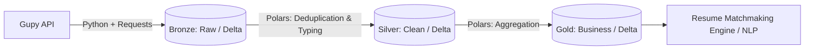
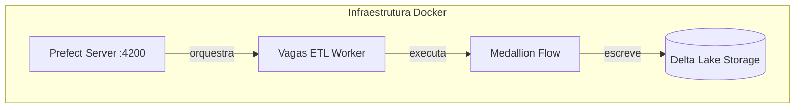

# 🎯 Data Engine para Matching de Currículos (Vagas CD)


## 📌 O Problema de Negócio

No cenário atual de recrutamento em tecnologia, a alta densidade e a desestruturação de textos em plataformas de vagas (como a Gupy) dificultam a triagem assertiva de candidatos. Este projeto atua como o **Data Pipeline estrutural** para resolver esse gargalo: ele ingere, processa e modela dados diários de oportunidades de trabalho, servindo bases analíticas limpas, padronizadas e tipadas para um sistema downstream de *Matchmaking* de currículos com vagas, movido a algoritmos de NLP e IA.

**Métricas e Impacto Esperado:**
Com este pipeline, esperamos reduzir o tempo de triagem manual de **horas para segundos**, processando **milhares de vagas diariamente** com uma latência *end-to-end* (da extração à Gold Layer) em torno de **< 2 minutos**. A resiliência da arquitetura permite extrair *insights* valiosos sem onerar o time com sustentação manual.

---

## 🔍 Preview / Demo do Output

Exemplo enriquecido e limpo gerado na camada final (`dim_vagas` - Gold Layer), pronto para ser consumido pelo motor de IA ou Dashboards Analíticos:

```json
{
  "vaga_id": "9382104",
  "titulo": "Pessoa Cientista de Dados Sênior",
  "descricao_limpa": "Venha fazer parte do nosso time de dados...",
  "empresa": "TechCorp S.A.",
  "localizacao": "São Paulo, SP",
  "modalidade": "híbrido",
  "nivel": 4,
  "area_principal": "dados",
  "is_tech": true,
  "data_expiracao": "2024-04-01",
  "data_publicacao": "2024-03-01T10:00:00.000000Z",
  "ano_publicacao": 2024,
  "mes_publicacao": 3,
  "url": "https://techcorp.gupy.io/jobs/9382104",
  "skills_tech": ["python", "machine learning", "sql", "spark", "aws"],
  "skills_soft": ["comunicação", "liderança"]
}
```

---

## 🏗️ Arquitetura (Como funciona)

O desenho da solução garante escalabilidade e fácil manutenção.

### Arquitetura de Dados (Medallion)
Garante qualidade de dados e rastreabilidade ponta a ponta:
* **🥉 Bronze (Ingestão):** Landing zone de dados brutos extraídos via API (JSON). A ingestão incremental por checkpoints economiza chamadas de rede.
* **🥈 Silver (Transformação e Limpeza):** *Data Cleansing*, tipagem estática e *Schema Enforcement*. Identificação única unificada da vaga.
* **🥇 Gold (Modelagem e Agregação):** Modelagem dimensional para consumo final (`dim_vagas`, `agg_skills_monitor`, `agg_market_trends`).



### Arquitetura de Infraestrutura
O gerenciamento dos recursos roda em contêineres e Storage local otimizado:



---

## 🛠️ Tecnologias Utilizadas

* **Linguagem Principal:** Python 3.13+
* **Processamento:** [Polars](https://pola.rs/) (Engine in-memory multithreaded em Rust, performance ultrarrápida sem depender de JVM/Spark)
* **Storage e Data Format:** [Delta Lake](https://delta.io/) (Garante propriedades ACID, Time Travel e suporte a Schema Evolution)
* **Orquestração e Observabilidade:** [Prefect 3.x](https://www.prefect.io/) (Gerenciamento do DAG, retries automáticos, logs centralizados)
* **Infraestrutura:** Docker & Docker Compose (Ambiente "plug-and-play")

---

## ⚙️ Instalação (Como rodar)

### Pré-requisitos
- Docker e Docker Compose nativos na sua máquina (ou servidor).

### Passo a Passo
1. **Clone o Repositório:**
   ```bash
   git clone https://github.com/dargmiguel/projeto-vagas-cd.git
   cd projeto-vagas-cd
   ```

2. **Configure suas Variáveis de Ambiente:**
   Crie um arquivo `.env` na raiz do projeto:
   ```env
   GUPY_API=https://api.gupy.io/api/v1/jobs
   INTERVAL_PIPELINE=1800  # Executar pipeline a cada 30 minutos
   DATA_PATH=/app/data
   ```

3. **Suba o Ambiente (Container-First):**
   ```bash
   docker-compose up -d --build
   ```

### Monitorando a Orquestração
Acesse a telemetria do Prefect abrindo em seu navegador:
👉 [http://localhost:4200](http://localhost:4200)

---

## 🚀 Uso e Consumo de Dados

Todo o dado processado descansa em tabelas Delta locais na pasta `data/gold_delta/`. Abaixo, um exemplo de consumo via Python:

```python
import polars as pl

# Invocando a Dimensão de Vagas (Gold Layer) pronta para análise
dim_vagas = pl.scan_delta("data/gold_delta/dim_vagas")
```

### 📋 Schema principal da `dim_vagas` (Gold)

| Coluna | Tipo | Descrição |
|--------|------|-----------|
| `vaga_id` | String | Identificador único da oportunidade |
| `titulo` | String | Nome / Cargo ofertado gerado na limpeza |
| `descricao_limpa` | String | Texto da vaga limpo sem tags HTML e caracteres especiais |
| `empresa` | String | Entidade contratante |
| `localizacao` | String | Cidade e estado da vaga |
| `modalidade` | String | Regime de trabalho (remoto, híbrido, presencial) |
| `nivel` | Int8 | Senioridade mapeada (1 a 5) |
| `area_principal` | String | Área de atuação classificada a partir do texto |
| `is_tech` | Boolean | Indica se a vaga foi classificada primariamente como tecnologia |
| `data_expiracao` | Date | Data limite para aplicação, se especificada |
| `data_publicacao` | Datetime | Data de publicação na plataforma de origem |
| `ano_publicacao` | Int32 | Ano extratído da publicação |
| `mes_publicacao` | Int8 | Mês extraído da publicação |
| `url` | String | Link da vaga na plataforma |
| `skills_tech` | Array[String] | Array contendo hard skills do texto parseado |
| `skills_soft` | Array[String] | Array contendo soft skills do texto parseado |

---

## 📂 Estrutura do Projeto

```text
projeto-vagas-cd/
├── src/
│   ├── bronze/     # Scripts de extração bruta via requests
│   ├── silver/     # Parse lógico e limpeza (Silver processor)
│   ├── gold/       # Agregações de negócio para Matchmaker
│   └── utils/      # Helpers e formatação global
├── flows/          # Definição e scheduling via Prefect
├── tests/          # TDD, qualidade e parsers contínuos
├── docker-compose.yaml
└── pyproject.toml  # Dependências fixadas (uv lock / pip)
```

---

## 🔬 Engineering Highlights (Boas Práticas)

1. **Ingestão Incremental Inteligente:** O crawler possui detecção de limites de paginação. Se esbarrar num lote de registros já ingeridos outrora, cessa automaticamente as requisições API à fonte.
2. **Idempotência no Processamento:** Utilizando a função `unique(subset=["vaga_id"], keep="first")` aliada ao Upsert do Delta Lake, garanto que o pipeline suporta *re-runs* infinitos sem duplicidade.
3. **Quality Gates & Tests:** Contratos rígidos suportados pelo `pytest` para extração de String/Regex evitando distorção no Feature Extraction que o motor vai consumir.
4. **Configuração Modular (YAML Driven):** As regras do pipeline são facilmente estendidas alterando arquivos de config para plugar rapidamente APIs alternativas além da Gupy.

---

## 🔧 Troubleshooting

* **Erro de conexão com a API Gupy:**
Verifique se a rede do Docker alcança a internet, ou se você levou um *Rate Limit*.
* **Tabela Delta Corrompida ou travada (Lock):**
Ocorrendo cancelamento intermitente nativo do Kernel, você pode reparar partições rodando um Script de manutenção da API do delta-rs python (ex: vacuum).
* **Worker do Prefect não liga:**
Leia os logs (`docker logs vagas_etl_worker -f`), garanta que o Prefect Server (porta 4200) subiu com sucesso primeiro e verifique a URL inserida no `.env`.

---

## 🗺️ Roadmap (Próximos Passos)

- [ ] Integração com outros ATSs (LinkedIn, Indeed) via módulos `src/bronze`.
- [ ] API REST (FastAPI) para disponibilização segura da Gold Layer sem compartilhamento de disco.
- [ ] Dashboard de rastreamento visual das "Top Skills Demandadas" (via Streamlit ou Metabase).
- [ ] Desenvolvimento adjacente do Motor NLP para realizar o cruzamento Vagas <-> Perfis baseado neste Delta Lake.

---
